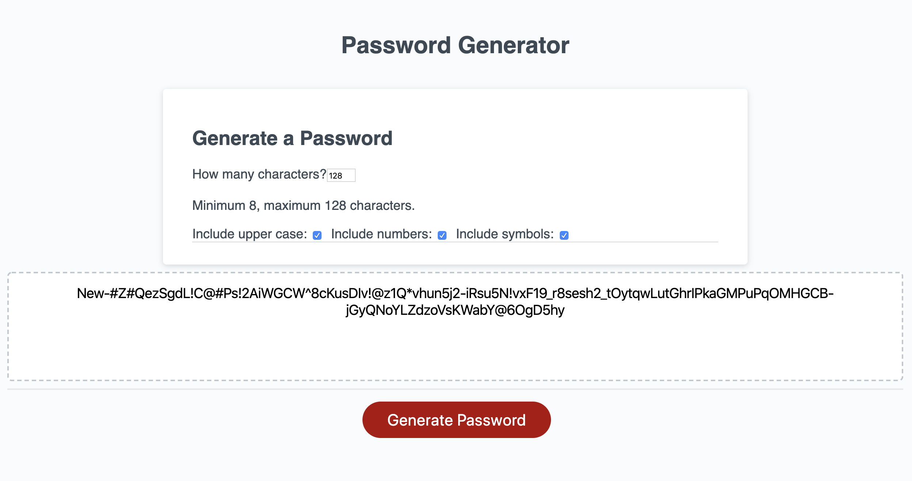

# Responsive Portfolio Website

### Description

This is an exercise in creating a random password generator through Javascript

- [User-Story](##User-Story)
- [Challenge](##Challenge)
- [Screenshots](##Screenshots)
- [Results](##Results)
- [Lessons-Learned](##Lessons-Learned)

## User-Story

AS AN employee with access to sensitive data\
I WANT to randomly generate a password that meets certain criteria\
SO THAT I can create a strong password that provides greater security

## Challenge

I was challenged to create a web application to run in browser that would generate a random password for website user. It should be generate a password based on user preferences, including the possible use of lower case letters, upper case letters, numbers and special characters. It should also return results between 8 and 128 characters in length.

The web application should also have a clean user interface that scales to different screen sizes.

## Screenshots

We were provided with the below image as a reference for our work.

Upon completion of the task, my on web application can be seen in the image below.

## Results

The required outputs of this project, including this README, the url of the deployed web application and the url of this repo.

- Deployed App - https://spatiality-dc.github.io/password-generator/

- Github Repo - https://github.com/spatiality-dc/password-generator

## Lessons Learned

Too many to count, but the main ones were the following:

- The 'for loop' iterator can be used to randomise results from an array;
- You can stack 'if' statements;
- When combining event listeners, you can run functions as local variables;
- It's important to name consts, vars and functions correctly to avoid confusion, because when it comes to key value pairs, names should be _similar_ but distinct.
